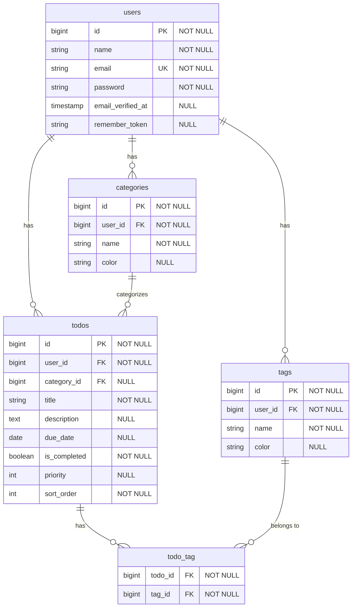

# TODOアプリ ER図

## テーブル定義説明

### users テーブル
ユーザー情報を管理するテーブル。Laravel標準の認証システムを使用。
- `id`: 主キー
- `name`: ユーザー名（必須）
- `email`: メールアドレス（必須、一意）
- `password`: パスワード（必須）
- `email_verified_at`: メール確認日時（任意）
- `remember_token`: ログイン状態保持用トークン（任意）

### todos テーブル
TODOタスク情報を管理するテーブル。
- `id`: 主キー
- `user_id`: タスクの所有者（必須）
- `category_id`: タスクのカテゴリー（任意）
- `title`: タスクのタイトル（必須）
- `description`: タスクの詳細説明（任意）
- `due_date`: 期限日（任意）
- `is_completed`: 完了フラグ（必須）
- `priority`: 優先度（任意、1-5など）
- `sort_order`: 表示順序（必須、ユーザーによる手動並び替え用）

### categories テーブル
タスクのカテゴリー情報を管理するテーブル。
- `id`: 主キー
- `user_id`: カテゴリーの所有者（必須）
- `name`: カテゴリー名（必須）
- `color`: カテゴリーの色（任意、HEXカラーコードなど）

### tags テーブル
タグ情報を管理するテーブル。複数のタスクに紐づけ可能。
- `id`: 主キー
- `user_id`: タグの所有者（必須）
- `name`: タグ名（必須）
- `color`: タグの色（任意、HEXカラーコードなど）

### todo_tag テーブル
TODOタスクとタグの多対多関係を管理する中間テーブル。
- `todo_id`: TODOタスクのID（必須）
- `tag_id`: タグのID（必須） 